<p align="center">
  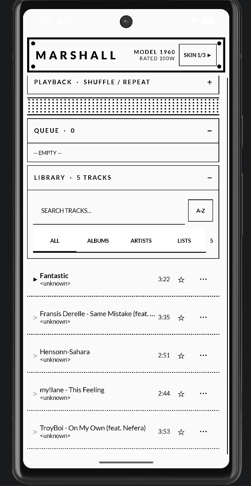
</p>

<h1 align="center">M Player</h1>

<p align="center"><b>One music player, three skins, built for E-Ink.</b></p>

<p align="center">
  <a href="LICENSE"></a>
  
  <a href="https://mudita.com"></a>
</p>

---

A local-library Android music player built on the [MMD framework](https://mudita.com) — Mudita's component library and design language for E-Ink screens. One shared playback engine (queue, shuffle, playlists, sleep timer, lock-screen controls) sits underneath three switchable visual skins, so the audio logic only has to be correct once.

## The three skins

- **Marshall** — amp-stack aesthetic: chunky rocker switches with LEDs, knob-style EQ, a "1960"-style header plate.
- **Synth** — monospace, sequencer-grid seek bar, lever-style toggles.
- **Soviet** — constructivist control-panel look, GOST plate, lock-lever switches with a guard bracket.

Tap `SKIN` in the header to cycle between them. All three read from the same `PlayerUiState`, so switching skins mid-playback never loses your place.

<p align="center">
  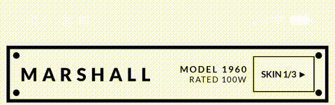
</p>

<p align="center">
  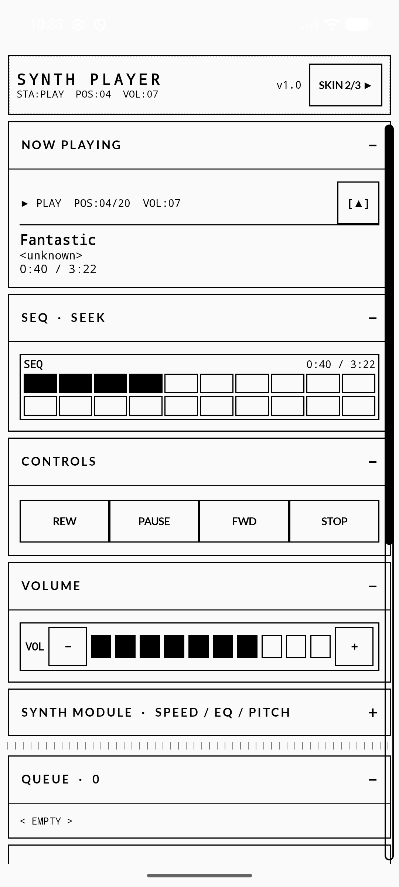
  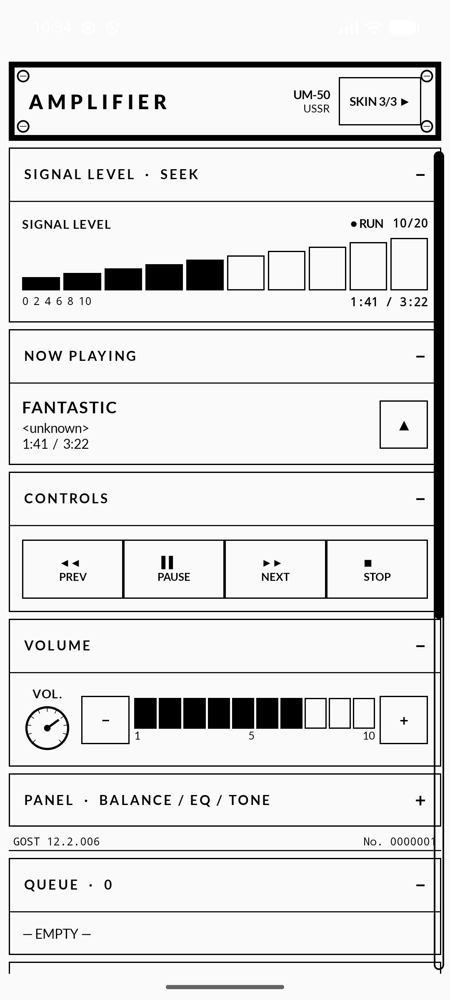
</p>

<p align="center">
  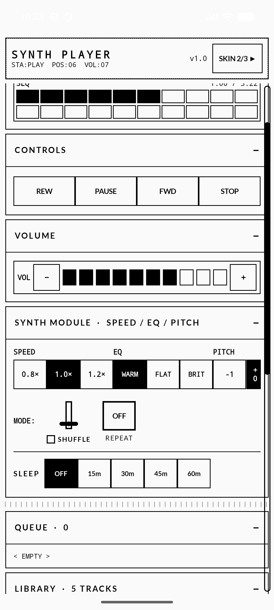
</p>

## E-Ink design rules

This isn't a Mudita device, but I held the UI to Mudita's own published E-Ink guidelines anyway, since they're the right constraints for this kind of screen regardless of hardware:

- **Pure black/white, no grey.** The whole app runs on MMD's own `ThemeMMD(eInkColorScheme, eInkTypography)` rather than a hand-rolled color scheme — every color role is hard black or white, down to roles a custom scheme would usually forget (`error`, `scrim`, `inverseSurface`).
- **Always show UI controls.** Every scrollable list has a persistent scrollbar — never gesture-only.
- **Avoid grey separators.** List rows are divided with a dashed pure-black line instead of a lighter solid one.
- **Follow the lines.** Every row in a given list shares one fixed height (long titles truncate with an ellipsis instead of wrapping), so dividers land in the same place on every redraw.
- **Minimise redraws.** Volume is ten discrete blocks instead of a slider — one tap, one redraw, instead of a continuous drag repainting every pixel of travel. The sleep timer follows the same logic, five steps total instead of a number ticking down every second.

<p align="center">
  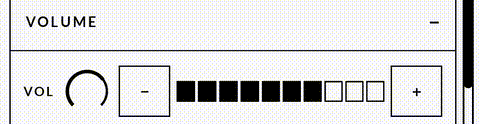
</p>

<p align="center">
  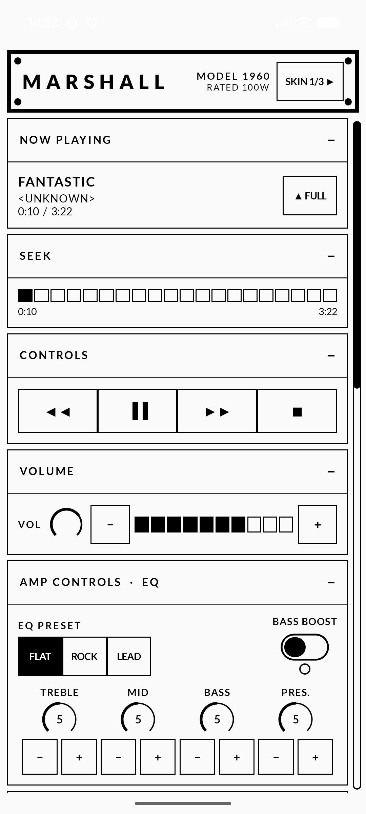
</p>

## Features

- **Shuffle that respects repeat mode** — a Fisher–Yates order that won't repeat a track until the whole list has played once, instead of an infinite random pick that ignored repeat settings.
- **Play-next queue**, separate from the shuffle/repeat order, managed from a per-track action sheet.
- **Playlists**, persisted locally, with their own tab in the library.
- **A 5-segment battery sleep timer** — depletes in exactly five visual steps over its duration.
- **Lock-screen and notification transport controls** via `MediaSessionCompat`.
- **Two-pane landscape layout** (now-playing/controls on one side, queue/library on the other) sharing all composables with portrait — no duplicated layout code.

<p align="center">
  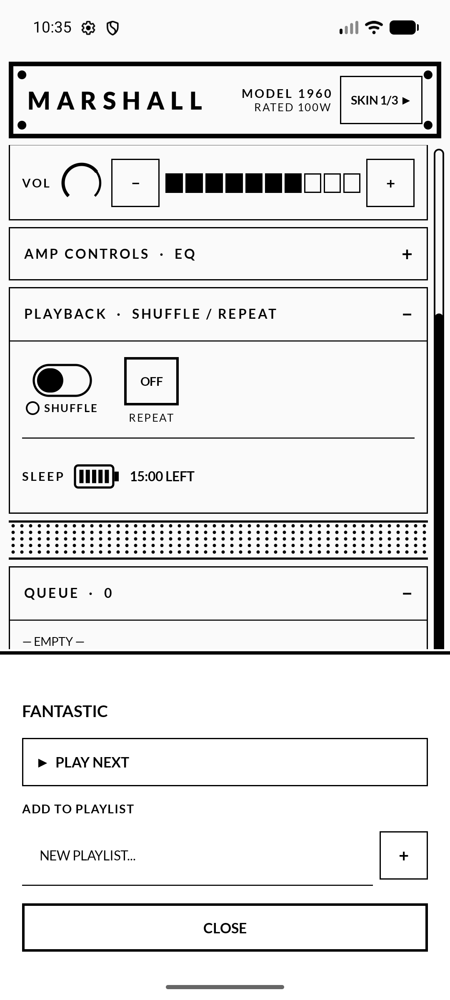
  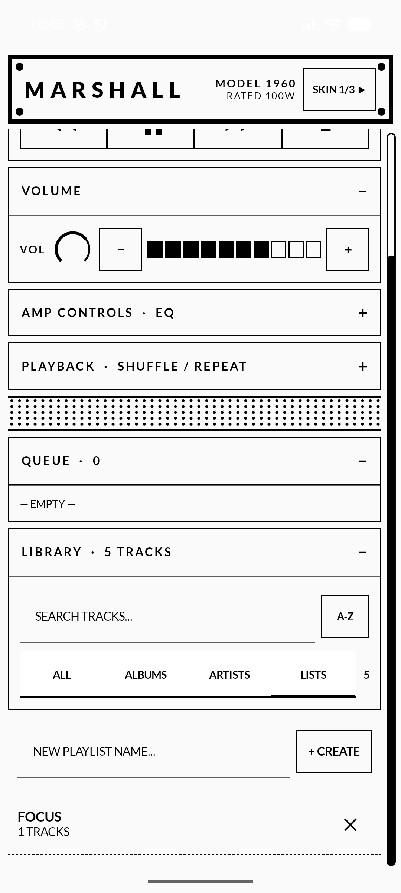
</p>

<p align="center">
  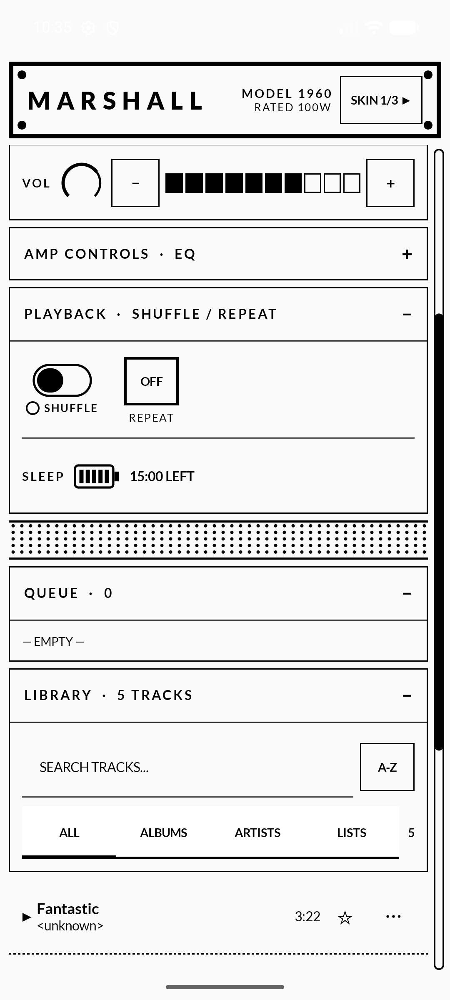
  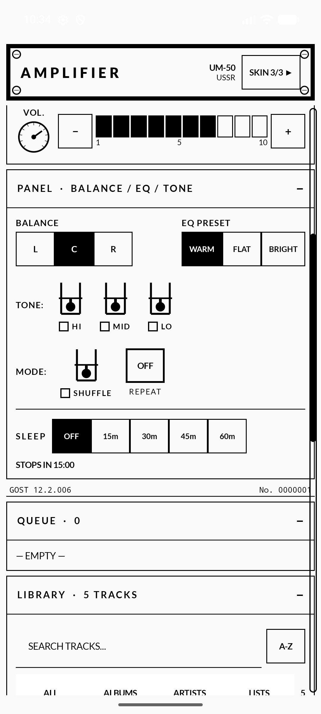
</p>

Landscape reuses the same composables in all three skins — only the top-level arrangement changes:

<p align="center">
  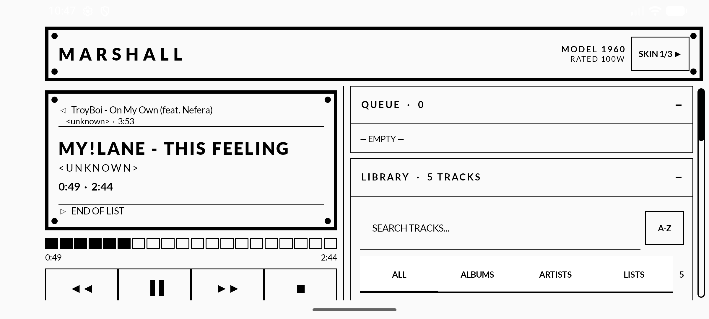
  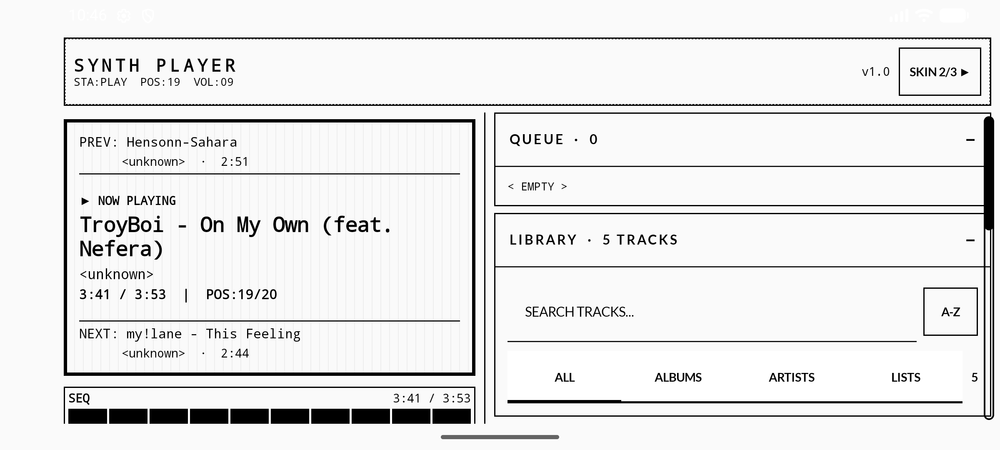
  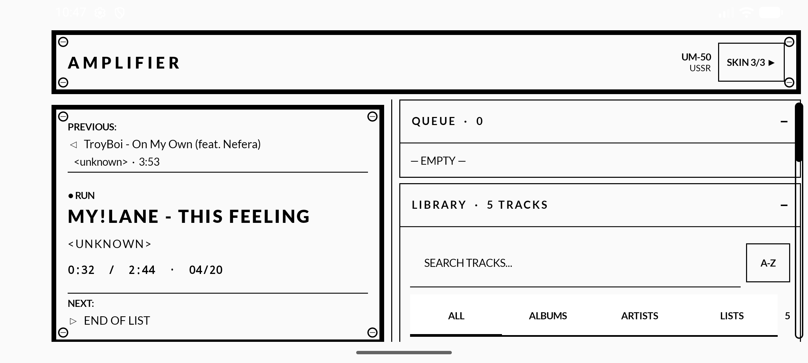
</p>

## A couple of MMD gotchas worth documenting

- `LazyColumnMMD` ships a built-in scrollbar, but its scrollability check is `totalItemsCount × firstVisibleItem.size`, which assumes every row is the same height. This app's lists mix collapsible panels of very different heights with track rows, so that check breaks. I wrote a custom scrollbar instead — count-based rather than height-based — and copied MMD's own rounded track/thumb styling for it.
- Material3's stock `AlertDialog` reads `colorScheme.surfaceContainerHigh` for its background. `eInkColorScheme` deliberately leaves that role `Color.Unspecified`, since Mudita's own components never touch it — so a stock `AlertDialog` renders with an invisible background. `ModalBottomSheetMMD` reads `surfaceContainerLow` instead, which `eInkColorScheme` does set. Worth checking which color role a component reads before assuming a theme swap is safe.

## MMD components used

`ThemeMMD`, `TextMMD`, `HorizontalDividerMMD`, `SecondaryTabRowMMD` / `TabMMD`, `TextFieldMMD`, `OutlinedButtonMMD`, `ModalBottomSheetMMD`

## Build

```bash
./gradlew assembleDebug
adb install app/build/outputs/apk/debug/app-debug.apk
```

Requires Android 9+ (API 28) — the MMD library sets this floor.

## Credits

Developed by <a href="https://github.com/Z01berg"></a>

## License

MIT — see [LICENSE](LICENSE).
